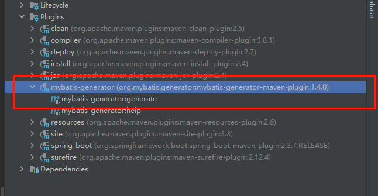

# SpringBoot集成mybatis-generator

--- 
1. mybatis-generator简介
   * mybatis-generator(mbg),又称为mybatis逆向工程,用于根据数据表自动生成实体类、mapper.xml、mapper.java
    文件,可以极大的提升工作效率
2. maven依赖
   ``` 

   <dependency>
       <groupId>org.mybatis.spring.boot</groupId>
       <artifactId>mybatis-spring-boot-starter</artifactId>
       <version>2.1.4</version>
   </dependency>
   <dependency>
       <groupId>mysql</groupId>
       <artifactId>mysql-connector-java</artifactId>
       <scope>runtime</scope>
   </dependency>
    <plugin>
        <groupId>org.mybatis.generator</groupId>
         <artifactId>mybatis-generator-maven-plugin</artifactId>
         <version>1.4.0</version>
    </plugin>
   ```
   * 需要依赖数据库驱动,这里我以MySQL为例
3. 配置解读
    ```xml
    <?xml version="1.0" encoding="UTF-8"?>
    <!DOCTYPE generatorConfiguration
            PUBLIC "-//mybatis.org//DTD MyBatis Generator Configuration 1.0//EN"
            "http://mybatis.org/dtd/mybatis-generator-config_1_0.dtd">
    
    <generatorConfiguration>
    
    
        <context id="mysql" targetRuntime="MyBatis3">
    
            <!-- 引入插件  -->
            <plugin type="org.mybatis.generator.plugins.SerializablePlugin" />
            <plugin type="org.mybatis.generator.plugins.ToStringPlugin" />
            <plugin type="com.itfsw.mybatis.generator.plugins.BatchInsertPlugin"/>
            <plugin type="com.itfsw.mybatis.generator.plugins.ModelColumnPlugin"/>
            <plugin type="com.itfsw.mybatis.generator.plugins.SelectOneByExamplePlugin"/>
    
            <!-- 注释 -->
            <commentGenerator >
                <property name="suppressAllComments" value="false"/><!-- 是否取消注释 -->
            </commentGenerator>
    
    
            <!--    数据库链接信息    -->
            <jdbcConnection driverClass="com.mysql.jdbc.Driver"
                            connectionURL="jdbc:mysql://127.0.0.1:3306/db_staging?useLegacyDatetimeCode=false&serverTimezone=Asia/Hong_Kong&useSSL=false&allowPublicKeyRetrieval=true"
                            userId="root"
                            password="root">
            </jdbcConnection>
    
            <!--    Java自动类型转换     -->
            <javaTypeResolver >
                <!-- 是否使用bigDecimal， false可自动转化以下类型（Long, Integer, Short, etc.） -->
                <property name="forceBigDecimals" value="false" />
            </javaTypeResolver>
    
            <!--    实体类存放的包    -->
            <javaModelGenerator targetPackage="com.zhang.example02mbg.entity" targetProject="src/main/java">
                <property name="enableSubPackages" value="true" />
                <property name="trimStrings" value="true" />
            </javaModelGenerator>
    
            <!--   xml文件存放的位置     -->
            <sqlMapGenerator targetPackage="mapper"  targetProject="src/main/resources/">
                <property name="enableSubPackages" value="true" />
            </sqlMapGenerator>
    
            <!--   生成mapper存放位置     -->
            <javaClientGenerator type="XMLMAPPER" targetPackage="com.zhang.example02mbg.dao"  targetProject="src/main/java">
                <property name="enableSubPackages" value="true" />
            </javaClientGenerator>
    
            <!--   数据表名     -->
            <table schema="DB2ADMIN" tableName="ALLTYPES" domainObjectName="Customer" >
                <property name="useActualColumnNames" value="true"/>
                <generatedKey column="ID" sqlStatement="DB2" identity="true" />
                <columnOverride column="DATE_FIELD" property="startDate" />
                <ignoreColumn column="FRED" />
                <columnOverride column="LONG_VARCHAR_FIELD" jdbcType="VARCHAR" />
            </table>
    
        </context>
    </generatorConfiguration>
    ```
    * 需在resource目录下新建一个generator.xml文件 填写配置信息  数据库配置 表名等

4. over

   
5. 欢迎大家关注我的GitHub 这个项目会写springboot集成各种东西的demo
   https://github.com/zhanghaorui/spring-boot-example.git